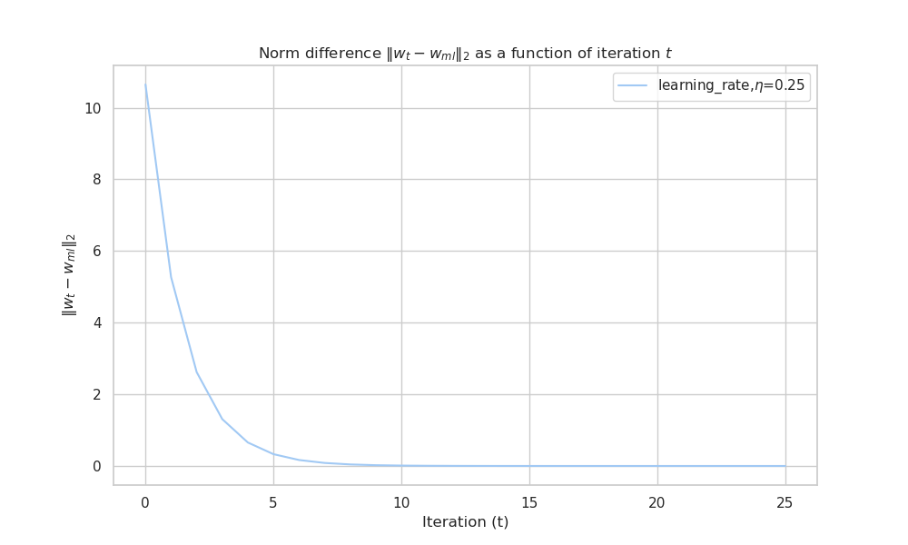

**Name : Venkatesh Duraiarasan**
**Roll No : DA24C021**

# FML  Assignment#1

## Summary

| Model/Method                                      | Train MSE | Test MSE | Weights            |
| ------------------------------------------------- | --------- | -------- | ------------------ |
| Linear Regression(Ordinary Least Square Solution) | 123.36    | 66.00    | [9.89, 1.76, 3.52] |
| Linear Regression(Gradient Descent)               | 123.36    | 66.00    | [9.89, 1.76, 3.52] |
| Linear Regression(Stochastic Gradient Descent)    | 129.88    | 68.62    | [9.89, 1.76, 3.52] |
| Linear Ridge Regression                           | 124.88    | 65.64    | [8.74, 1.52, 3.14] |
| Kernel Regression (Polynomial Kernel degree=2)    | 0.0101    | 0.0098   | -                  |
|                                                   |           |          |                    |


[TOC]

#### Dataset

#### Visualizing the dataset

Lets visualize the data using 3d surf plot. Here  `x1`, `x2` are the features and the last column target is $y$ plotted in `z` axis. The function appears to be **quadratic**.


## 1. Analytical Least Squares Solution

* Write a piece of code to obtain the least squares solution $w_{ML}$ to the regression problem using the analytical solution.

### Solution

#### Code Implementation

The task was to compute the least squares solution \( $w_{ML}$ \) to the regression problem using the analytical closed-form solution:

$$
w_{ML} = (X^T X)^{-1} X^T y
$$

#### Addition of Bias 

The extra bias column of ones is appended to the input columns

#### Mean Squared Error (MSE)

To evaluate the model, the MSE was computed for both the training and test sets using the formula:
$$
\text{MSE} = \frac{1}{n} \sum_{i=1}^{n} (y_{\text{actual}} - y_{\text{pred}})^2
$$

#### Results

The results were:

- weights for least squares solution= $w_{ML}= [9.89400832, 1.76570568, 3.5215898 ]$

- Mean Squared Error (MSE) on train set: 123.3649

- Mean Squared Error (MSE) on test set: 66.0055

  

#### Visualising the fit for Least square solution

Plot showing features ($x1, x2$) and target variable $y$ in 3d surf plot


From the plot we can see the hyper plane and the function curve


Mean Squared Error (MSE) on train set: 123.3649


#### Observations

* The plot of actual vs predicted we can see the ordinary least square is not fitting the output properly. This is mainly due to non linearity as one can see from the visualisation of surface plot

## 2. Gradient Descent

* Code the gradient descent algorithm with suitable step size to solve the least squares algorithms and plot $∥w_t − w_{ML}∥_2$ as a function of $t$. 
* What do you observe?

### Solution

#### Code Implementation

##### Code for gradient descent


Gradient Descent Update Rule 

$$
w_{t+1} = w_t - \eta \nabla f(w_t)
$$
   where $( \eta )$ is the learning rate (step size),   

```python
# function to perform gradient descent
def gradient_descent(X, y, wt_initial, learning_rate, iterations):

    no_of_observations, no_of_features = X.shape
    wt_curr = wt_initial
    
    for t in range(iterations):
        gradient = calc_gradient(X,y,wt_curr) 
        wt_curr = wt_curr - learning_rate * gradient  # Update the weights

    return wt_curr
```

##### Code for calculating the gradient

   $$ \nabla f(w_t) = \dfrac{2X^T (X w_t - y)}{n}  $$   

   is the gradient of the least squares cost function.

```python
# gradient calculation
def calc_gradient(X, y, wt ):
  no_of_observations = X.shape[0]
  gradient = 2 * np.dot(X.T, (np.dot(X, wt) - y))/no_of_observations
  return gradient
```

##### Code for calculating the Norm Difference

To plot $ || w_t - w_{ml} ||_2 $, where $ w_{ml} $ is the analytical solution obtained using the formula $$w_{ml} = (X^T X)^{-1} X^T y$$ and $w_t$ weight at the $t$ th  iteration in the gradient descent procedure

```python
# Euclidean norm ∥w_t − wML∥2
def norm_distance(wt_history, w_ml):
    wt_diffs = [np.linalg.norm(w - w_ml) for w in wt_history]
    return np.array(wt_diffs)
```


#### Choosing the learning rate

##### Learning Rate and Convergence

The performance of gradient descent depends on the choice of the learning rate \( $\eta$ \). 

For some interval range of $\eta=[0.0001, 0.001, 0.01, 0.1, 0.25, 0.5 ]$ the gradient descent was performed and the convergence of $w_t$ is checked

| Learning Rate \( $\eta$ \)          | Observation                                         |
| ----------------------------------- | --------------------------------------------------- |
| 0.0001                              | Slow convergence                                    |
| 0.001                               | Moderate convergence                                |
| 0.25                                | Approaches minimum quickly                          |
| 0.5                                 | Fastest convergence (for the given range of $\eta$) |
| 1.0                                 | Diverges (no convergence)                           |
|  |                                                     |

The norm \( $\|w_t - w_{ML}\|_2$ \) was plotted for different learning rates. A learning rate of \( $\eta = 0.25$​ \) was chosen because it converged rapidly with minimal fluctuations.



#### Observations

- **Optimal Weights (Gradient Descent)**: 
  $$
  w_{GD} = [9.8940, 1.7657, 3.5216]
  $$
  
- **Norm Difference**: The difference between the gradient descent solution and the analytical solution decreases rapidly with each iteration, approaching zero.

- **MSE (Gradient Descent)**:
  
  - **Train MSE**: 123.3649
  - **Test MSE**: 66.0055

These values match the analytical solution, confirming the correctness of the gradient descent implementation.

## 3. Stochastic Gradient Descent (SGD)

Code the stochastic gradient descent algorithm using batch size of 100 and plot $||w_t − w_{ML}||_2$ as a function of $t$. What are your observations?

### Solution

For the stochastic gradient descent (SGD) method, the gradient is computed using randomly sampled batches of the data. A batch size of 100 was used, and the learning rate was set to 0.11.


#### Observations
- **Weights (SGD)**: After 400 iterations, the weights obtained were:
  $$
  w_{SGD} = [9.8940, 1.7657, 3.5216]
  $$
  
- **Norm Difference**: The norm \( $||w_t - w_{ML}||_2$​ \) decreases over time, indicating convergence toward the optimal solution. However, the norm fluctuates more than with traditional gradient descent due to the stochastic nature of the batch sampling.

- Mean Squared Error (MSE) on **train** set(stochastic gradient descent): 129.8843

- Mean Squared Error (MSE) on **test** set(stochastic gradient descent): 68.6248


## 4. Ridge Regression

Code the gradient descent algorithm for ridge regression. 
Cross-validate for various choices of $λ$ and plot the error in the validation set as a function of λ. 
For the best $λ$ chosen, obtain $w_R$. 
Compare the test error (for the test data in the file FMLA1Q1Data test.csv) of $w_R$ with $w_{ML}$. 
Which is better and why?

### Solution


Ridge regression adds a regularization term \( $\lambda \|w\|^2$ \) to the cost function, penalizing large weights to prevent overfitting. 

#### Cross-Validation for ( $\lambda$​ \)


Performed 5-fold cross-validation to determine the optimal value of \( $\lambda$ \). The validation error (MSE) was calculated for different values of \( $\lambda$ \), ranging from 0 to 0.5. The plot of validation error vs. \($\lambda$ \) helped to choose the optimal regularization parameter.

- **Optimal \( $\lambda$ \)**: \( 0.1315 \)
- **Validation MSE**: 122.5971

####  Analyse the effect of regularisation on the features


* we can see as the lambda increases weights decrease rapidly approaching zero
* Also the MSE shooting rapidly up as the lambda increases as the regularisation term is more significant than gradient term

#### Observations

##### Final Results with Ridge Regression

After training the ridge regression model with the optimal \( $\lambda$​ \), the following results were obtained:

* weights for Ridge Regression $w_R$ = [8.74879124 1.52347261 3.14639795]

- **Train MSE**: 124.8870
- **Test MSE**: 65.6490

The regularized model performs slightly better on the test data compared to the unregularized least squares solution.

## 5. Kernel Regression

Assume that you would like to perform kernel regression on this dataset. 
**Which Kernel would you choose and why?** 

> We can choose the n degree polynomial regression as the plot surface looks quadratic. Also the polynomial function is easier than other complex function like caternary function and several other non parametric function

**Code the Kernel regression algorithm and predict for the test data.** 

> Kernel regression was tested for various polynomial degree and for degree 2 the average validation set error came low. Hence  quadratic kernel was choosen as optimum model for our data. After train the model the MSE for test set is **0.0110**

**Argue why/why not the kernel you have chosen is a better kernel than the standard least squares regression.**

> Kernel (Quadratic) is better than the standard least squares because the MSE for kernel regression is way lower than the MSE of  standard least squares.
>
> Also from the visualiation we can clearly see the non linearity of the input data hence the standard least squares(linear fit) will be misfit for non linear data
>
> We can see the goodness of fit in below graphs


We can see the blue dots are all close to the actual y values in the below graph


* **Mean Squared Error (MSE) on train set: 0.0101**
* **Mean Squared Error (MSE) on test set: 0.0098**


## Conclusion

- The **analytical solution** and **gradient descent** yield identical results in terms of weights and MSE.
- **Stochastic gradient descent** converges similarly but with more fluctuations.
- **Ridge regression** with cross-validation improves generalization slightly by reducing overfitting, as evidenced by the lower test MSE for the ridge model with \( $\lambda = 0.1315$​ \).
- **Kernel Regression** fits the y data perfectly and models  the nonlinearity present in the dataset very well

